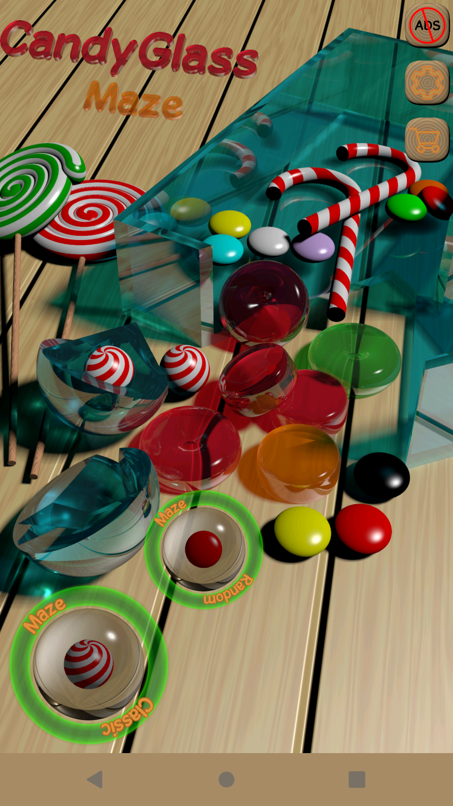
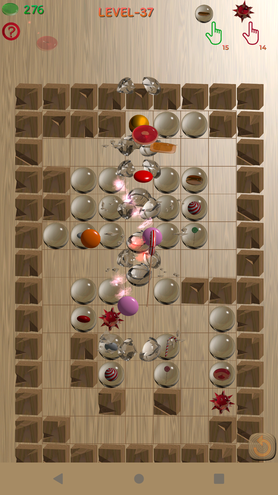

# Candy Glass Maze

Hobby project, almost everything is generated by code! Even assets!

Sample screenshots:

*Everything you see above, is generated by code :-)*

* Developed in mainly kotlin.
* Used [libGDX](https://libgdx.com/) cross-platform Java game development framework based on OpenGL (ES) that works on Windows, Linux, macOS, Android, browser and iOS.
* Modular design both with gradle modules and [Dagger](https://dagger.dev/)
  * Why dagger? Because it is also deployable in IOS, DI frameworks with `Java Reflection` is problematic in native builds.
  * Reflection also may be problematic in android side, as far as I know.
  * [Robovm](https://github.com/MobiVM/robovm) is used in IOS side.
  * Since [Robovm](https://github.com/MobiVM/robovm) is used, kotlin bytecode version is 8.
* Assets are generated with the help of following tools:
  * [Povray](http://www.povray.org/), The Persistence of Vision Raytracer is a high-quality, Free Software tool for creating stunning three-dimensional graphics.
  * [OpenSCAD][https://openscad.org/] OpenSCAD is software for creating solid 3D CAD models.
  * I have implemented a DSL (Domain Specific Language) in [Xtext](https://eclipse.dev/Xtext/) for these:
   * While designing 3D models for my game, I wanted to see the result in OpenSCAD instantly.
   * Also, I wanted to create povray scripts from this DSL. This DSL is subset of OpenSCAD language.
   * This DSL plugin, makes the transformations from scad to povray instantly.
   * This DSL plugin, makes the transformations from scad to povray instantly.
  * I open sourced this project [scad2pov](https://github.com/erdinc09/scad2pov). I will update this as soon as I have time!
  * Also, I have created GIMP plugins, which I used to crop the glass pictures from their backgrounds. I also open sourced it, [gimp-povray-crop](https://github.com/erdinc09/gimp-povray-crop)

# Notes:

* JDK 17 in desktop environment.

# TODOs

* add povray and gimp scripts
* upgrade to java21
* document dagger design, module dependencies ...
* fix native builds, jlink (currently broken)
* experiment with graalvm